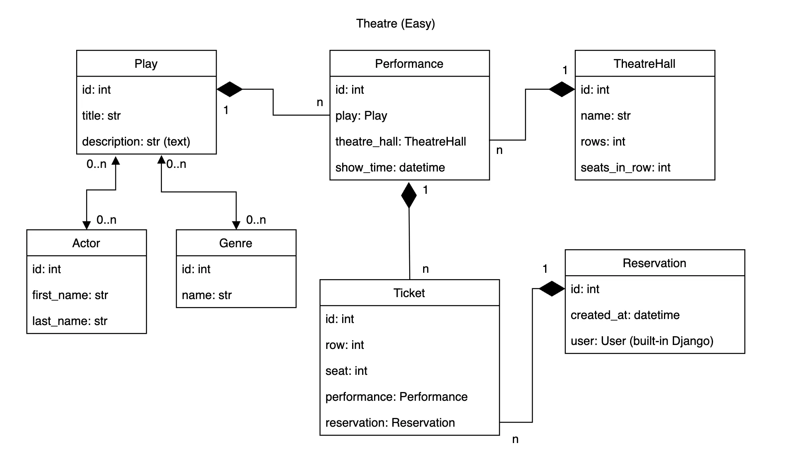
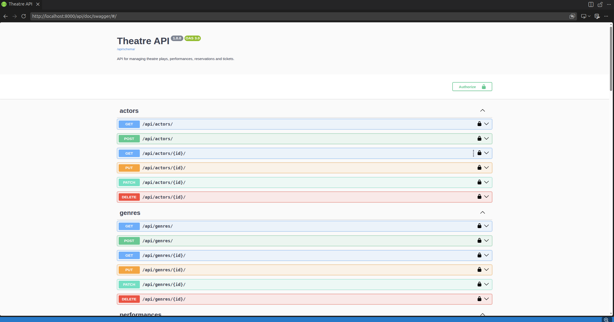

# Theatre API Service

API for online theatre ticket booking: browse plays, performances, and reserve seats without visiting the box office in person.

## Features

- JWT authentication (registration, token obtain/refresh)
- CRUD for plays, actors, genres, theatre halls, performances
- Reservations with multiple tickets created in a single transaction
- Seat (row/seat) validation within hall bounds and duplicate-seat checks
- Filtering plays by title/actors/genres, performances by play and date
- Permissions: read access for any authenticated user, write access to reference data for staff only
- API documentation via Swagger and Redoc
- Test coverage (models, permissions, filtering, reservation logic)

## Installing using GitHub

```bash
git clone https://github.com/MykolaLozanDevelopment/theatre-service.git
cd theatre-service
python -m venv .venv
source .venv/bin/activate
pip install -r requirements.txt
```

Create a `.env` file in the project root, for example:
```
POSTGRES_DB=theatre
POSTGRES_USER=theatre_user
POSTGRES_PASSWORD=your_password
POSTGRES_HOST=localhost
POSTGRES_PORT=5432
DJANGO_SECRET_KEY=your_secret_key
```

```bash
docker compose up -d db
python manage.py migrate
python manage.py createsuperuser
python manage.py runserver
```

## Run with Docker

Docker should be installed.

```bash
docker compose up --build
```

The API will be available at `http://localhost:8000/`.

## Getting access

- Create a user: `POST /api/user/register/`
- Obtain a JWT token: `POST /api/user/token/`
- Use the token: header `Authorization: Bearer <access_token>`

## Documentation

- Swagger: `/api/doc/swagger/`
- Redoc: `/api/doc/redoc/`

## DB Structure



## Demo


